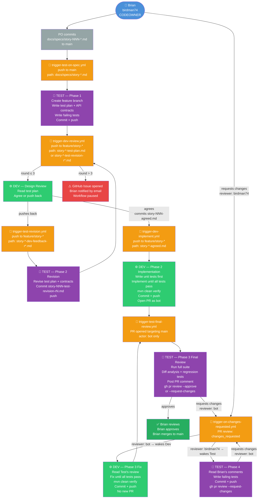

# StreamVault Agentic Workflow — Automation Reference

This document shows the complete automated workflow, which GitHub Actions trigger fires at each step, and which persona is woken. All triggers run on the self-hosted runner. Manual `workflow_dispatch` overrides are available for every trigger.

---

## Workflow Diagram



---

## Trigger Summary Table

| Trigger File | Event | Path Filter | Actor Filter | Wakes |
|---|---|---|---|---|
| `trigger-test-on-spec.yml` | push to `main` | `docs/specs/story-*.md` | `birdman74` or bot | Test Phase 1 |
| `trigger-dev-review.yml` | push to `feature/story-*` | `story-*-test-plan.md` or `story-*-test-revision-r*.md` | `birdman74` or bot | Dev design review |
| `trigger-test-revision.yml` | push to `feature/story-*` | `story-*-dev-feedback-r*.md` | `birdman74` or bot | Test Phase 2 revision |
| `trigger-dev-implement.yml` | push to `feature/story-*` | `story-*-agreed.md` | `birdman74` or bot | Dev Phase 2 implementation |
| `trigger-test-final-review.yml` | PR opened/reopened targeting `main` | — | bot only | Test Phase 3 final review |
| `trigger-on-changes-requested.yml` | PR review `changes_requested` | — | `birdman74` → Test; bot → Dev | Test Phase 4 or Dev Phase 3 fix |

---

## Escalation

If Test and Dev complete 3 rounds of design iteration without agreement, `trigger-dev-review.yml` opens a GitHub Issue:

```
⚠️ story-NNN: Design iteration limit reached — Brian review required
```

Brian receives an email notification. The workflow pauses until Brian manually commits `story-NNN-agreed.md`.

---

## Manual Override

Every trigger supports `workflow_dispatch` from the GitHub Actions tab. Use when a container exited before completing its work, a push happened before the workflow existed, or you need to re-run a phase without re-triggering the preceding step.

---

*This document lives in `ai-dev-toolkit` because it documents the reusable workflow framework.*