# StreamVault Agentic Workflow — Automation Reference

This document shows the complete automated workflow, which GitHub Actions trigger fires at each step, and which persona is woken. All triggers run on the self-hosted runner. Manual `workflow_dispatch` overrides are available for every trigger.

---

## Workflow Diagram

```mermaid
flowchart TD
    BRIAN(["👤 Brian\nbirdman74\nCODEOWNER"])

    PO_COMMIT["PO commits\ndocs/specs/story-NNN-*.md\nto main\nCreates GitHub Issue\nlabeled 'story'"]

    T1["🔔 trigger-test-next-story.yml\npush to main path: docs/specs/story-*.md\nOR PR merged to main\nQueue manager finds next eligible story\nMarks GitHub Issue 'in-progress'"]

    TEST_P1["🧪 TEST — Phase 1\nCreate feature branch\nWrite test plan + API contracts\nWrite failing tests\nCommit + push"]

    T2["🔔 trigger-dev-review.yml\npush to feature/story-*\npath: story-*-test-plan.md\nor story-*-test-revision-r*.md"]
    DEV_REVIEW["⚙️ DEV — Design Review\nRead test plan\nAgree or push back"]

    ESCALATION["⚠️ GitHub Issue opened\nBrian notified by email\nWorkflow paused"]

    T3["🔔 trigger-test-revision.yml\npush to feature/story-*\npath: story-*-dev-feedback-r*.md"]
    TEST_P2["🧪 TEST — Phase 2 Revision\nRevise test plan + contracts\nCommit + push"]

    T4["🔔 trigger-dev-implement.yml\npush to feature/story-*\npath: story-*-agreed.md"]
    DEV_IMPL["⚙️ DEV — Phase 2 Implementation\nWrite unit tests first\nImplement until all tests pass\nmvn clean verify\nCommit + push\nOpen PR as bot"]

    T5["🔔 trigger-test-final-review.yml\nPR opened targeting main\nactor: bot only"]
    TEST_P3["🧪 TEST — Phase 3 Final Review\nRun full suite\nDiff analysis + regression tests\nPost PR comment\ngh pr review --approve\nor --request-changes"]

    T6["🔔 trigger-on-changes-requested.yml\nPR review: changes_requested\nreviewer: birdman74 only"]
    TEST_P4["🧪 TEST — Phase 4\nRead Brian's comments\nWrite failing tests\nCommit + push\nPush is the trigger for Dev"]

    T7["🔔 trigger-dev-on-test-commit.yml\npush to feature/story-*\npath: src/test/**\nauthor: claude-streamvault-test\nPR must have changes_requested"]
    DEV_P3["⚙️ DEV — Phase 3 Fix\nRead new failing tests\nFix until all tests pass\nmvn clean verify\nCommit + push\nNo new PR"]

    T8["🔔 trigger-test-on-dev-fix.yml\npush to feature/story-*\nauthor: claude-streamvault-dev\nOpen PR must exist"]
    TEST_REVERIFY["🧪 TEST — Re-verification\nPull branch\nRun full suite\nPost updated PR comment\ngh pr review --approve\nor --request-changes"]

    MERGE["✅ Brian reviews\nBrian approves as CODEOWNER\nBrian merges to main"]

    CLOSE["🔔 trigger-test-next-story.yml\nPR merged event\nCloses completed GitHub Issue\nFinds and starts next eligible story"]

    BRIAN --> PO_COMMIT
    PO_COMMIT --> T1
    T1 --> TEST_P1
    TEST_P1 --> T2
    T2 -->|"round ≤ 3"| DEV_REVIEW
    T2 -->|"round > 3"| ESCALATION
    DEV_REVIEW -->|"pushes back"| T3
    T3 --> TEST_P2
    TEST_P2 --> T2
    DEV_REVIEW -->|"agrees"| T4
    T4 --> DEV_IMPL
    DEV_IMPL --> T5
    T5 --> TEST_P3
    TEST_P3 -->|"approves"| MERGE
    TEST_P3 -->|"requests changes"| T6
    BRIAN -->|"requests changes"| T6
    T6 --> TEST_P4
    TEST_P4 -->|"pushes failing tests"| T7
    T7 --> DEV_P3
    DEV_P3 -->|"pushes fix"| T8
    T8 --> TEST_REVERIFY
    TEST_REVERIFY -->|"approves"| MERGE
    TEST_REVERIFY -->|"requests changes"| T6
    MERGE --> CLOSE
    CLOSE -->|"next eligible story exists"| T1

    style BRIAN fill:#4A90D9,color:#fff
    style ESCALATION fill:#E84545,color:#fff
    style MERGE fill:#27AE60,color:#fff
    style CLOSE fill:#27AE60,color:#fff
    style T1 fill:#F39C12,color:#fff
    style T2 fill:#F39C12,color:#fff
    style T3 fill:#F39C12,color:#fff
    style T4 fill:#F39C12,color:#fff
    style T5 fill:#F39C12,color:#fff
    style T6 fill:#F39C12,color:#fff
    style T7 fill:#F39C12,color:#fff
    style T8 fill:#F39C12,color:#fff
    style TEST_P1 fill:#8E44AD,color:#fff
    style TEST_P2 fill:#8E44AD,color:#fff
    style TEST_P3 fill:#8E44AD,color:#fff
    style TEST_P4 fill:#8E44AD,color:#fff
    style TEST_REVERIFY fill:#8E44AD,color:#fff
    style DEV_REVIEW fill:#2ECC71,color:#fff
    style DEV_IMPL fill:#2ECC71,color:#fff
    style DEV_P3 fill:#2ECC71,color:#fff
    style PO_COMMIT fill:#95A5A6,color:#fff
```

---

## Trigger Summary Table

| Trigger File | Event | Path / Condition Filter | Author / Actor Filter | Wakes |
|---|---|---|---|---|
| `trigger-test-next-story.yml` | push to `main` OR PR merged | `docs/specs/story-*.md` or any PR merge | human or bot | Test Phase 1 (via queue manager) |
| `trigger-dev-review.yml` | push to `feature/story-*` | `story-*-test-plan.md` or `story-*-test-revision-r*.md` | human or bot | Dev design review |
| `trigger-test-revision.yml` | push to `feature/story-*` | `story-*-dev-feedback-r*.md` | human or bot | Test Phase 2 revision |
| `trigger-dev-implement.yml` | push to `feature/story-*` | `story-*-agreed.md` | human or bot | Dev Phase 2 implementation |
| `trigger-test-final-review.yml` | PR opened/reopened targeting `main` | — | bot only | Test Phase 3 final review |
| `trigger-on-changes-requested.yml` | PR review `changes_requested` | — | human only | Test Phase 4 |
| `trigger-dev-on-test-commit.yml` | push to `feature/story-*` | `src/test/**` + PR in `changes_requested` | author: Test persona | Dev Phase 3 fix |
| `trigger-test-on-dev-fix.yml` | push to `feature/story-*` | open PR must exist | author: Dev persona | Test re-verification |

---

## Story Queue Manager

Stories are managed as GitHub Issues labeled `story`. The queue manager (`scripts/next-story.sh`) runs inside `trigger-test-next-story.yml` and:

1. Errors if any story issue is labeled `in-progress` (single-threaded constraint)
2. Lists all open `story` issues sorted by issue number
3. For each candidate reads `## Prerequisites` from the spec file
4. Checks all prerequisite story issues are closed (completed)
5. Returns the lowest-numbered eligible story

When a PR merges, `trigger-test-next-story.yml` automatically closes the completed story issue, then immediately finds and starts the next eligible story.

---

## Why Not gh pr review to Trigger Dev?

GitHub prevents the PR author from reviewing their own PR. Since Dev and Test share the same bot account and Dev opens the PR, Test cannot submit a formal review. The solution is push-based triggering: Test pushes failing tests, `trigger-dev-on-test-commit.yml` detects the commit author and PR state to distinguish this from Phase 1 test commits.

---

## Escalation

If Test and Dev complete 3 rounds of design iteration without agreement, `trigger-dev-review.yml` opens a GitHub Issue notifying Brian by email. The workflow pauses until Brian manually commits `story-NNN-agreed.md`.

---

## Manual Override

Every trigger supports `workflow_dispatch` from the GitHub Actions tab with explicit input parameters.

---

*This document lives in `ai-dev-toolkit` because it documents the reusable workflow framework.*